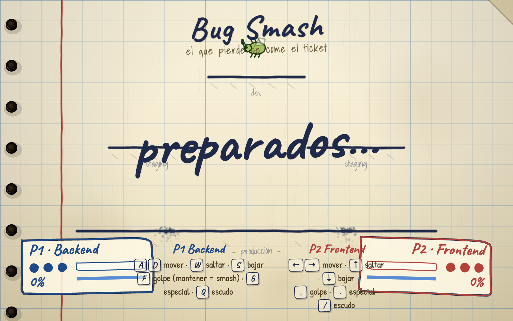
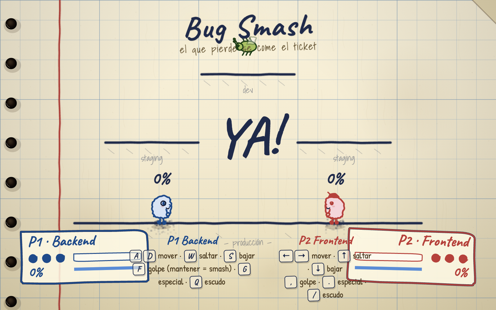

<div align="center">



# 🐛 Bug Smash

**Backend contra Frontend: dos jugadores, una hoja de cuaderno y el que pierde se come el ticket.**

[](https://gavilanbe.github.io/bug-smash/)


</div>

---

## 🐛 Qué es esto

Bug Smash es un juego de lucha local para dos jugadores dibujado a mano sobre una hoja de cuaderno. **P1 "Backend"** y **P2 "Frontend"** se enfrentan en un duelo a golpes, smashes, especiales y escudos hasta que uno cae. La estética es puro papel cuadriculado: trazos temblorosos, tipografía manuscrita y todo renderizado en `<canvas>` con primitivas vectoriales generadas en código (sin una sola imagen). Es un solo `index.html` autocontenido, sin dependencias.

## 🎮 Cómo se juega

**P1 — Backend**

| Tecla | Acción |
|---|---|
| `A` / `D` | Mover izquierda / derecha |
| `W` | Saltar |
| `S` | Bajar |
| `F` | Golpe (mantener = smash) |
| `G` | Ataque especial |
| `Q` | Escudo |

**P2 — Frontend**

| Tecla | Acción |
|---|---|
| `←` / `→` | Mover izquierda / derecha |
| `↑` | Saltar |
| `↓` | Bajar |
| `,` | Golpe (mantener = smash) |
| `.` | Ataque especial |
| `/` | Escudo |

## 📸 Capturas

| En el ring | A repartir |
|:--:|:--:|
|  |  |

## ▶️ Jugar

La forma más fácil: **[gavilanbe.github.io/bug-smash](https://gavilanbe.github.io/bug-smash/)**.

### En local

```bash
git clone https://github.com/gavilanbe/bug-smash.git
cd bug-smash
python3 -m http.server 8000
# abre http://localhost:8000
```

## 🛠️ Bajo el capó

- JavaScript puro (vanilla) sobre la **Canvas 2D API**.
- Dibujo **procedural** con efecto "hand-drawn": cada trazo se genera en código con su propio temblor.
- HTML/CSS sin frameworks ni paso de build.
- Mecánicas de pelea completas: golpe, smash (mantener), especial y escudo.
- Un único `index.html` autocontenido, sin dependencias.

## 📦 Créditos

Parte de mi colección de juegos. Publicado por [**@gavilanbe**](https://github.com/gavilanbe).

## 📄 Licencia

[MIT](LICENSE)

<div align="center"><sub>HECHO A MANO · 2026</sub></div>
